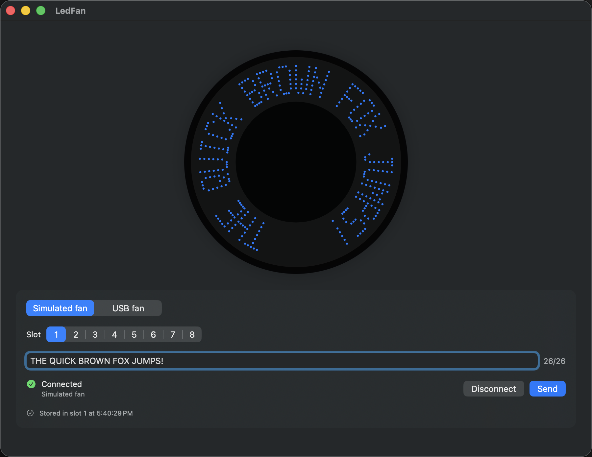

# LedFan

*A nine-year-old USB LED fan, a MacBook, and a summer of finding out what it wanted to hear.*

I have had this little USB fan for about nine years. It is the kind with LEDs on one blade
that paint a message in the air while it spins: eight messages, up to 26 characters each,
cycling through the factory demo since the day I bought it. It came with a mini CD and a
Windows-only editor, both long gone. I always meant to program it from my Mac and never had
the time to learn how USB devices actually talk. This year, with Claude doing the heavy
lifting on the bits I never got round to, I finally had some fun digging into it.

This repository is what came out: a finished macOS app, a complete record of the hardware
investigation, and one unsolved puzzle that somebody with the right piece of software could
close in an afternoon.

## What works

A native macOS app (Swift 6, SwiftUI, no third-party dependencies) where you:

- type a message into one of eight slots, up to 26 characters, with a live counter
- see it exactly as the fan would paint it, in a polar preview with letters that stay upright
  across the top of the disc
- watch long messages scroll as a marquee, or not, if you have Reduce Motion on
- keep all eight drafts between launches
- connect to the real fan, which the app finds and identifies

And one thing it does with its eyes open: it writes a message table to the fan in the only
format anyone has recovered, which belongs to a sibling model, and then tells you plainly
that nothing is expected to appear. Read on.



## The fan

It turned out to be a SONiX microcontroller that shows up on USB as a HID device, vendor
`0c45`, product `7701`, with eleven blue LEDs on the arm. Two things about it shaped the
whole story:

1. **It has two cables.** The USB-A one is power only. The data port is on the *rotating
   head*, so the fan cannot spin while it is being programmed. You program it still, unplug,
   plug the power back in, and only then see whether anything changed. Every experiment
   costs a cable swap. I made twelve.
2. **It never talks back.** Whatever you send, it accepts and says nothing. There is no
   acknowledgement and no way to read its memory over USB.

## The investigation, briefly

- **Day one.** Got the app compiling and talking to the fan. Tried every documented probing
  route: listened, read reports, swept every possible first byte, walked every bit. The fan
  accepted everything and did nothing. Then a full sweep of every two-byte command with an
  all-ones payload **erased the factory demo**. The fan has been dark since. Lesson learned
  and written down in large letters.
- **Prior art.** Found two open-source projects for a *sibling* fan from the same vendor
  (`0c45:7160`), which store rasterised text as 16-bit columns in a small message table.
  Tried their format on ours, in every encoding and addressing model we could think of.
  Dark.
- **The vendor editor.** Found the sibling's Windows editor and took it apart without ever
  running it: how it frames packets, how it checksums, how it waits for an acknowledgement
  our fan never gives, how it encodes its font tables (not encrypted, just padded in a way
  that fooled every guess until the decoder itself was read). It hard-codes the sibling's
  product ID and knows nothing about ours.
- **The last swap.** One final batch of the best remaining candidates, designed so that
  whatever appeared would be unambiguous. Nothing appeared, except a dim blue blink of two
  LEDs at power-on, which is just the fan saying hello.

The one solid clue: only commands starting with `A0` ever make the fan pause, and `A0` is
the address of a common little EEPROM chip on an I2C bus. The best model is that the head
is a tiny bridge writing whatever you send straight into that chip, and that the *layout*
of the message table inside it is what nobody knows. Our fan appears to be a later
hardware generation ("USB Fan Version 3.0" in the vendor's own words) than any editor that
has surfaced online.

## Where you could pick this up

Everything is in `docs/`. Start with [`docs/current-state.md`](docs/current-state.md), then
the end of [`docs/protocol-findings.md`](docs/protocol-findings.md), which is the whole
experiment log including every negative result, and closes with a summary written for
exactly this moment.

Three things would reopen the hardware chapter:

- **the editor that shipped with a `0c45:7701` fan**, or any "USB Fan Version 3.0" editor:
  a disassembly of its upload routine answers the question with no cable swaps at all
- **a USB capture** of that editor programming one of these fans
- **a second fan** of the same model, to compare against

If you have any of those, the app is ready for you: the write path is real and tested end
to end with the sibling's format, and the only type that changes when this fan's format
arrives is one serializer. The tests and the rest of the app will not notice.

## Building and running

Xcode 26 or later, macOS 26.5. No hardware needed; the app runs against a simulated fan.

```bash
xcodebuild -project LedFan.xcodeproj -scheme LedFan -destination 'platform=macOS' build
xcodebuild -project LedFan.xcodeproj -scheme LedFan -destination 'platform=macOS' test
```

`Tools/` holds the throwaway probes used on the fan. They write to the device; read
[`docs/hardware.md`](docs/hardware.md) and the guardrail in
[`docs/protocol-discovery.md`](docs/protocol-discovery.md) before running any of them, and
remember what happened to my demo.

`vendor/` holds the sibling fan's Windows editor for static analysis. Nothing in it was
ever executed here, and there is no reason to start.

## How it was built

The whole thing was done as a conversation between me at the fan and Claude at the
keyboard, in short slices, each with a written brief and an acceptance report that says
plainly what worked, what did not, and where the brief itself was wrong. Those reports are
in [`docs/reports/`](docs/reports/) and are honestly the most useful thing in the repo if you
want to know how a nine-year-old gadget resisted a determined summer.

It was fun. The fan is still dark. Somebody out there has the CD.
