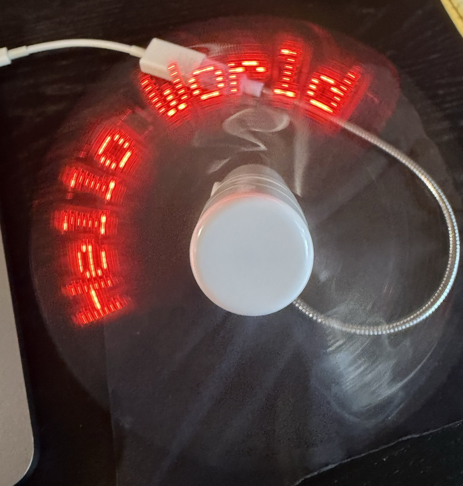
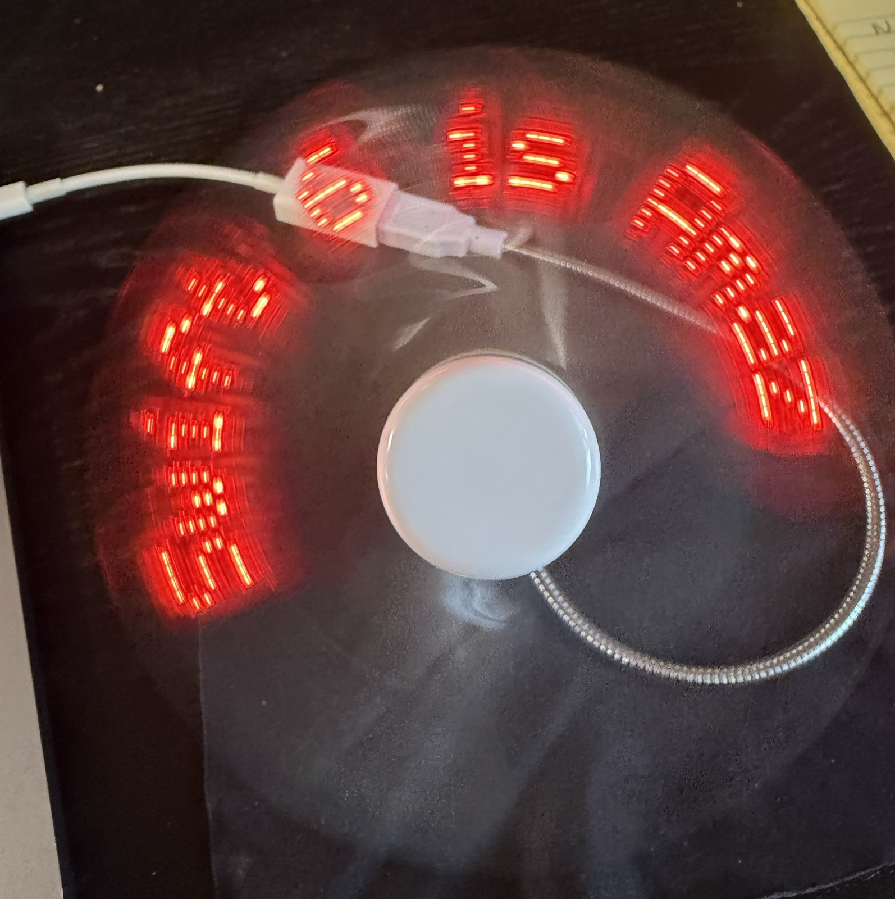
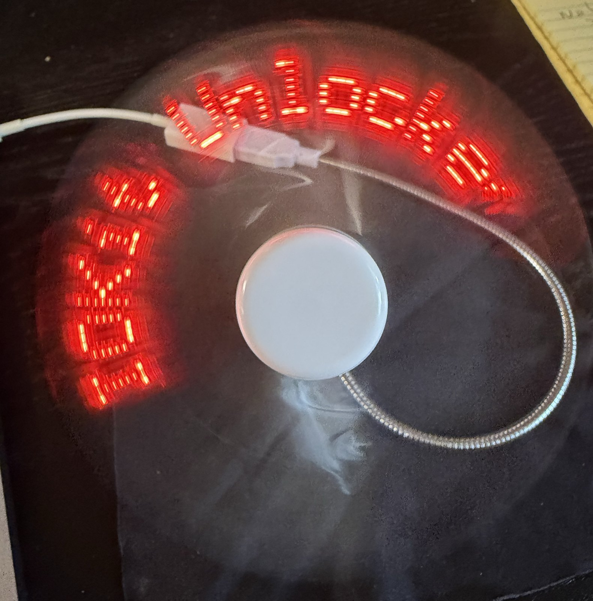
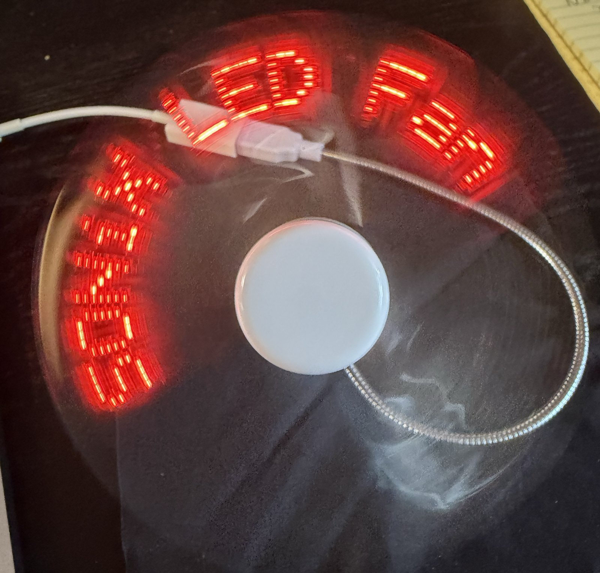
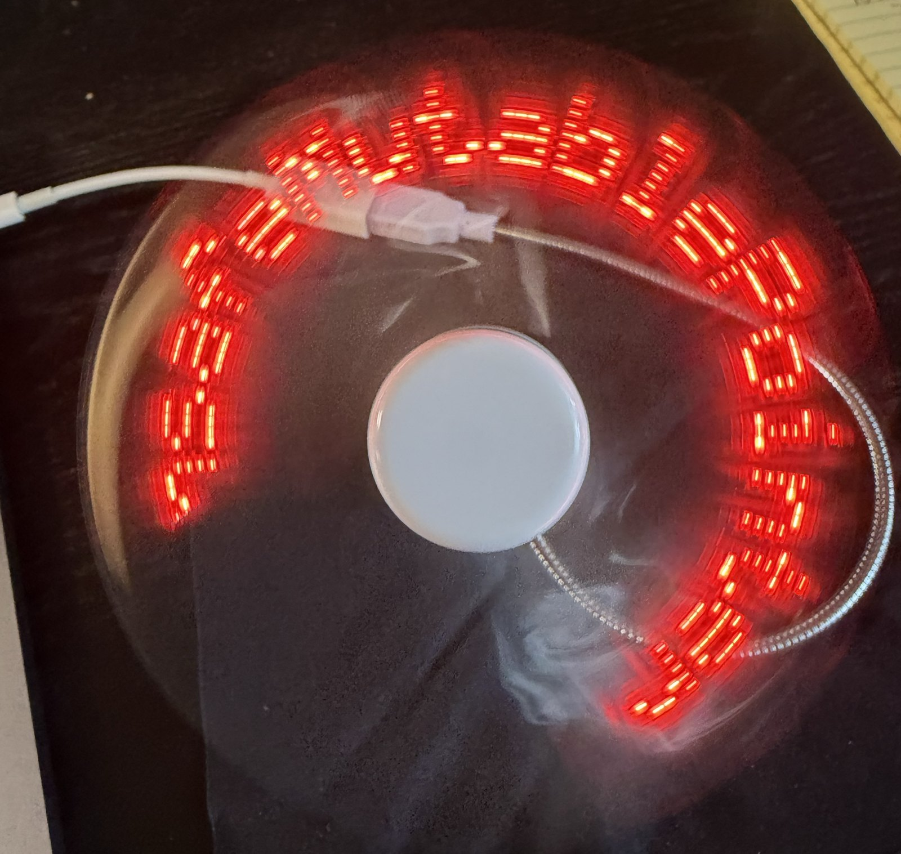
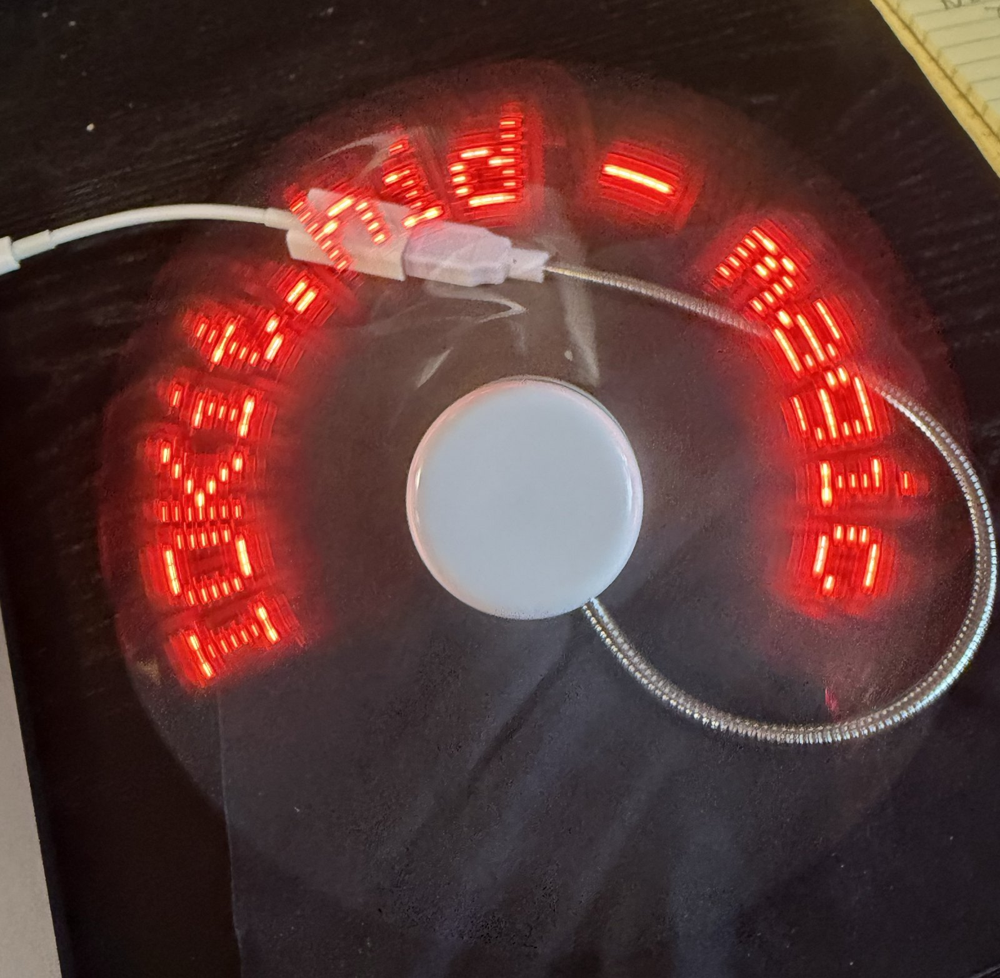

# LedFan

*A nine-year-old USB LED fan, a MacBook, and a summer of finding out what it wanted to hear.*

I have had this little USB fan for about nine years. It is the kind with LEDs on one blade
that paint a message in the air while it spins: eight messages, up to 26 characters each,
cycling through the factory demo since the day I bought it. It came with a mini CD and a
Windows-only editor, both long gone. I always meant to program it from my Mac and never had
the time to learn how USB devices actually talk. This year, with Claude doing the heavy
lifting on the bits I never got round to, I finally had some fun digging into it.

This repository is what came out: a finished macOS app that writes my own messages to the
fan, and a complete record of how its protocol was found — including the three weeks I spent
certain that nobody had ever published it.

## What works

A native macOS app (Swift 6, SwiftUI, no third-party dependencies) where you:

- type up to eight messages, 26 characters each, upper and lower case, into eight fields
  with live counters
- see the one you are editing exactly as the fan would paint it, in a polar preview with
  letters that stay upright across the top of the disc
- watch long messages scroll as a marquee, or not, if you have Reduce Motion on
- keep all eight drafts between launches
- connect to the real fan, which the app finds, identifies, and notices when it is unplugged
- **write your messages to it**, and watch them come round in the air

One press of Send publishes every filled field and replaces whatever the fan held; empty
fields are left out, so four messages give a four-message cycle with no dark gaps. The app
checks its own work: the fan echoes every packet back, so a send is confirmed report by
report rather than hoped at. Getting to that point took most of a month, and the rest of
this is how.


## The fan

It turned out to be a SONiX microcontroller that shows up on USB as a HID device, vendor
`0c45`, product `7701`, with eleven LEDs on the arm (red, as it turned out, whatever the
box said). Two things about it shaped the
whole story:

1. **It has two cables.** The USB-A one is power only. The data port is on the *rotating
   head*, so the fan cannot spin while it is being programmed. You program it still, unplug,
   plug the power back in, and only then see whether anything changed. Every experiment
   costs a cable swap. I made fifteen.
2. **It only talks back when you get it right.** Send it nonsense and it accepts everything
   in silence, which is how I spent weeks believing it was mute. Send it a correctly framed
   packet and it echoes every one straight back. There is still no way to read its memory.

## The investigation, briefly

- **Day one.** Got the app compiling and talking to the fan. Tried every documented probing
  route: listened, read reports, swept every possible first byte, walked every bit. The fan
  accepted everything and did nothing. Then a full sweep of every two-byte command with an
  all-ones payload **erased the factory demo**. That head never displayed anything again.
  Lesson learned and written down in large letters.
- **Prior art.** Found two open-source projects for a *sibling* fan from the same vendor
  (`0c45:7160`), which store rasterised text as 16-bit columns in a small message table.
  Tried their format on ours, in every encoding and addressing model we could think of.
  Dark.
- **The vendor editor.** Found the sibling's Windows editor and took it apart without ever
  running it: how it frames packets, how it checksums, how it waits for an acknowledgement
  our fan never gives, how it encodes its font tables (not encrypted, just padded in a way
  that fooled every guess until the decoder itself was read). It hard-codes the sibling's
  product ID and knows nothing about ours.
- **The last swap.** One final batch of the best remaining candidates, designed so that
  whatever appeared would be unambiguous. Nothing appeared, except a dim blue blink of two
  LEDs at power-on, which is just the fan saying hello.

The one solid clue held up, though not for the reason I thought: only commands starting
with `A0` ever made the fan pause. I read that as the I2C address of a little EEPROM chip.
It is actually the first byte of the protocol's own header — the fan was reacting to the
one byte of a real command that I kept stumbling into by accident.

## Where you could pick this up

Everything is in `docs/`. If you only read one thing, read
[`docs/retrospective.md`](docs/retrospective.md): what the breakthrough actually was, and the
four separate times I concluded something firm from an instrument nobody had checked.
[`docs/protocol-findings.md`](docs/protocol-findings.md) is the full experiment log,
negative results included, which is most of it.

What is left is all optional. The format carries a colour flag that nothing exposes yet,
and the fan displays red although it was sold as green, so colour may already be free. The
header carries opening and closing effect codes, transcribed but unused. And the 5x7
lowercase is legible on a spinning blade except for `m` versus `n` and `u` versus `U`, if
anyone wants to draw a better one.

If you have one of these fans, the app should just work: `0c45:7701`, eight messages, 26
characters each. Plug in the data cable with the fan switched off, press Connect, then
Send; swap to the power cable and the new messages come round.

## Building and running

Xcode 26 or later, macOS 26.5. No hardware needed; the app runs against a simulated fan.

```bash
xcodebuild -project LedFan.xcodeproj -scheme LedFan -destination 'platform=macOS' build
xcodebuild -project LedFan.xcodeproj -scheme LedFan -destination 'platform=macOS' test
```

`Tools/` holds the throwaway probes used on the fan. They write to the device; read
[`docs/hardware.md`](docs/hardware.md) and the guardrail in
[`docs/protocol-discovery.md`](docs/protocol-discovery.md) before running any of them, and
remember what happened to my demo.

`vendor/` holds the sibling fan's Windows editor for static analysis. Nothing in it was
ever executed here, and there is no reason to start.

## Update, September 2026: the protocol exists

The original head was destroyed while being opened. Two new fans arrived with the same
USB ID, and the search that finally worked started from the retailer's name rather than the
chip's: the PEARL PX5939 has two open-source drivers, and its header opcode is the `A0` the
old head kept reacting to. The app now speaks that protocol, validated byte for byte
against the Rust driver before any packet went out, and on 25 September the first send put
`HELLO WILLIE` on the blades, upright and readable. The fan is no longer dark.

The rest followed in two more slices: all eight slots in one send, lowercase included, with
every one of the 320 packets confirmed by the fan's echo; the app noticing when the cable
comes out instead of failing on the next write; and a compacted send, so a few filled
fields give a short cycle rather than eight with blanks. The interface grew from one field
to eight, the USB fan became the default, and the diagnostics moved out of the window
and into a log.

## The first demo

Eight messages of my own, written from the app and photographed spinning. The letters are
painted by eleven LEDs on one blade, so a still camera sees a whole revolution at once —
which is also exactly how your eye sees it.

| | | |
|:--:|:--:|:--:|
|  |  |  |
|  |  |  |

Full-resolution originals are in [`docs/reports/images/demo/`](docs/reports/images/demo/).

## Credits

- **[pearlfan-rs](https://github.com/mwja/pearlfan-rs)** by Jacob MacKenzie-Websdale,
  MIT / Apache-2.0. The packet layout, header constant, effect codes and pixel format were
  taken from its source, and its library generated the golden bytes the Swift encoder is
  tested against (`Tools/PearlFanGolden/`).
- **[Ventto/pearlfan](https://github.com/Ventto/pearlfan)**, GPLv3, the original
  reverse-engineering of the PX5939 that pearlfan-rs is based on. No code from it is used
  here; it is credited as the work that made the rest possible.
- [fergofrog/microwave_usb_fan](https://github.com/fergofrog/microwave_usb_fan) and
  [marcin-osowski/usb_fan](https://github.com/marcin-osowski/usb_fan), whose write-ups of the
  sibling `0c45:7160` fan shaped the generation-2 encoder that stays in the app.

## How it was built

The whole thing was done as a conversation between me at the fan and Claude at the
keyboard, in short slices, each with a written brief and an acceptance report that says
plainly what worked, what did not, and where the brief itself was wrong. Those reports are
in [`docs/reports/`](docs/reports/) and are honestly the most useful thing in the repo if you
want to know how a nine-year-old gadget resisted a determined summer.

It was fun. The fan says hello now. The CD was never needed after all.
