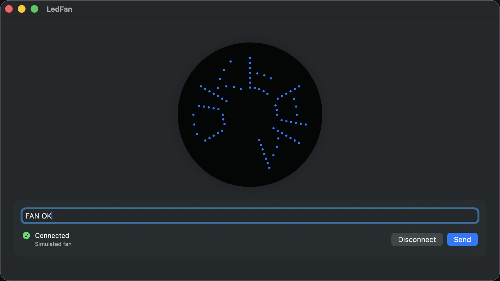
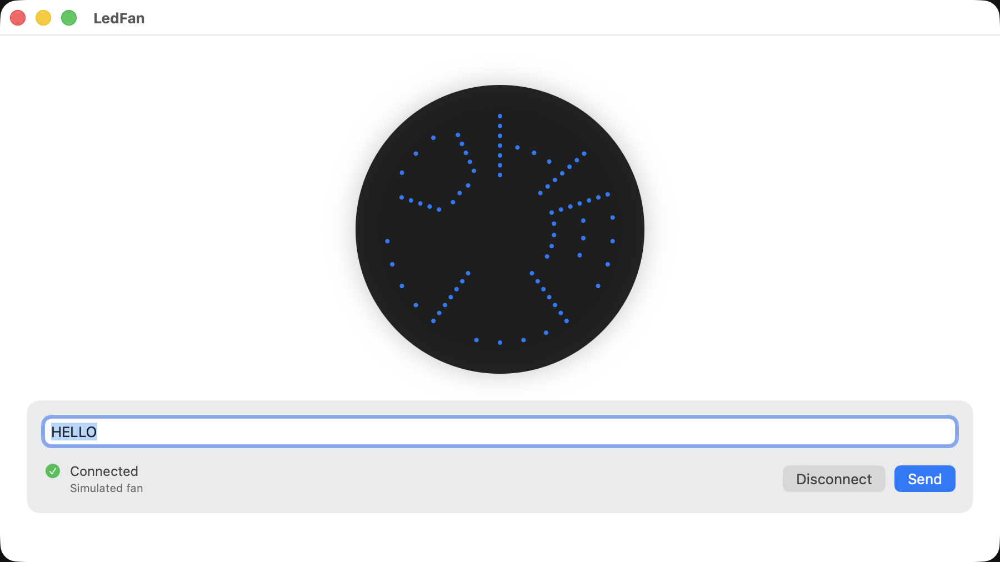

# Slice 1 — first build, green tests, Milestone 1

**Date:** 2026-09-01
**Scope:** onboarding.md "First tasks" 1–5. Hardware (task 6) deliberately not started.
**Status:** complete, awaiting architect approval. Nothing is committed; all changes are in
the working tree on `main`.

## Summary

The draft compiled with far less repair than the docs predicted. The app now builds
warning-free in Swift 6 language mode with strict concurrency complete, carries the USB
entitlement, passes 36 tests (34 unit, 2 UI), and demonstrates Milestone 1 end to end
against the simulated transport in both appearances.

| Definition of done | Result |
|---|---|
| Builds with no warnings | Yes. 0 warnings in the result bundle (the `appintentsmetadataprocessor` line is tool noise, not a compiler warning). |
| Tests pass | Yes. 36/36. |
| `features.md` boxes ticked only where demonstrable | Yes. 22 ticked, 4 left open, all four need the device. |
| Hardware learnings written into docs | Nothing new about the hardware was learned; the build facts went into `current-state.md` and `onboarding.md`. |
| Acceptance report | This document. |

## What changed

### Project settings — `LedFan.xcodeproj/project.pbxproj`
- `SWIFT_VERSION` 5.0 → 6.0 and `SWIFT_STRICT_CONCURRENCY = complete` on all three targets.
- `ENABLE_RESOURCE_ACCESS_USB = YES` on the app target. This is the build-setting form of
  Signing & Capabilities → App Sandbox → Hardware → USB; no `.entitlements` file exists.
  Verified with `codesign -d --entitlements` on the built product: the bundle carries
  `com.apple.security.app-sandbox`, `com.apple.security.device.usb`,
  `files.user-selected.read-only` and `get-task-allow`.

### Source
- **Isolation.** The project sets `SWIFT_DEFAULT_ACTOR_ISOLATION = MainActor`, which the
  docs never mention. Every Domain protocol and value type, the packet-encoding protocol
  and encoder, and the private `Array.chunked` helper are now declared `nonisolated`.
  Without that, `HIDFanTransport` would have to hop to the main actor to encode a frame.
- **`GlyphFont.columns(for:)`** trapped on any character whose uppercase form is more than
  one character (`"ß"` → `"SS"`), via `Character(String)`. It now returns a blank glyph.
  This was the only genuine bug in the draft.
- **`SimulatedFanTransport`** uses `AsyncStream.makeStream` instead of capturing the
  continuation out of the build closure.
- **`HIDFanTransport`** keeps the `IOHIDManager` alive alongside the device and closes both
  on `disconnect()`, and closes the manager on every failure path in `connect()`. Still
  untested and unexercised, as `testing.md` intends. Logic unchanged otherwise.
- **`FanTransportError.deviceNotFound`** copy now names the power-only USB-A cable and the
  second port explicitly, per `design.md` "Tone".
- **Presentation.** `ContentView` gained a Disconnect button, a status label (SF Symbol +
  text + transport name, combined into one accessibility element), an error banner, a
  material card for the controls, and a `ViewThatFits` so the control row reflows at large
  Dynamic Type sizes. `FanSimulatorView` gained a shadow and an empty-state accessibility
  label. `Theme.swift` gained the tokens those needed. `FanConnectionStatus` gained
  `isConnected` and `isBusy`.

### Tests
- Unit suites went from 16 to 34 cases, covering everything `testing.md` lists that was
  missing: `disconnect()` on a never-connected transport, observing `frames`, packet count
  versus density, sequence numbering including the wrap at 256, zero padding, negative and
  ≥16 arm lengths, control characters, multi-character uppercase, configurable spacing,
  determinism, error copy, a failing `display(_:)`, adopting the transport's arm length,
  and disconnect returning to `.disconnected`. `RecordingTransport` now takes `ledsPerArm`
  and `displayShouldFail`.
- `LedFanUITests` template files replaced with one XCTest class (XCUIApplication needs
  XCTest, so Swift Testing was not an option). It types a message, checks the preview
  label follows it, checks Send is disabled, connects, sends, checks no error is shown,
  disconnects, and attaches a window screenshot. A second case launches with
  `-NSRequiresAquaSystemAppearance YES` to capture light appearance.

### Housekeeping
- `_to_delete/` removed after confirming both files were byte-identical to the versions in
  the initial commit.
- `build/` added to `.gitignore` (used as `-derivedDataPath` for command-line builds).
- `docs/onboarding.md` and `docs/current-state.md` rewritten to describe the compiled
  state; `docs/features.md` boxes ticked.

## Evidence

```
xcodebuild -project LedFan.xcodeproj -scheme LedFan -destination 'platform=macOS' test
```

Result bundle summary: `result: Passed, totalTestCount: 36, passedTests: 36, failedTests: 0`.
Build warnings: 0.




## Where the specification was wrong or silent

1. **Scheme.** `onboarding.md` said the scheme lived in `xcuserdata/` and was unshared. No
   scheme file exists anywhere in the project; Xcode auto-creates it from the targets and
   `xcodebuild -scheme LedFan` finds it. Corrected in `onboarding.md`.
2. **Entitlement.** Described as a Capabilities-editor step. It is a single build setting.
   Corrected in `current-state.md`.
3. **Default actor isolation.** `SWIFT_DEFAULT_ACTOR_ISOLATION = MainActor` is set and
   undocumented. It changes how every Domain type must be declared. Documented in
   `current-state.md` under "Build settings that matter".
4. **Member import visibility.** `SWIFT_UPCOMING_FEATURE_MEMBER_IMPORT_VISIBILITY` is on,
   so test files that touch `localizedDescription` need their own `import Foundation`. This
   was the only compile error in the whole session. Documented.
5. **"Expect the concurrency annotations to need real work."** They did not. The draft's
   actor and `@MainActor` structure was right; only the isolation defaults needed handling.
6. **Preview geometry.** `design.md` says each column maps to an angle around the circle.
   The implementation divides 360° by the column count, so "HI" draws with wide letters and
   "HELLO WORLD" with narrow ones. A real fan has a fixed number of columns per revolution.
   See open question 1.

## Open questions for the architect

1. **Angular resolution.** Should `POVFrame` carry, or the preview assume, a fixed column
   count per revolution (padding short messages, clipping or scrolling long ones)? This
   affects the rasterizer contract and the preview, and is better decided before the
   encoder is replaced with a real one.
2. **Transport selection.** `architecture.md` says selecting the real transport is an
   explicit act, but no UI exists for it. Proposed: a `Picker` in the controls card bound to
   a `TransportKind` on the ViewModel, with the ViewModel building the transport through a
   small injected factory protocol so the view still never sees a concrete transport.
3. **F3 "the UI can consume frames".** The simulated transport's `frames` stream is tested
   but the UI does not read it; the preview shows the rasterised message, not what was
   last sent. Is a second "on the fan" indicator wanted, or is the current preview
   sufficient for Milestone 1? I left it as is and recorded it in `current-state.md`.
4. **`GlyphFont.supportedCharacters`** is unused. Keep for a future "unsupported
   characters" hint in the UI, or delete?

## Proposed next slice — Milestone 2 groundwork

The fan was enumerating on 2026-09-01 (`ioreg` shows SONiX, `idProduct 0x7701`).

1. Transport picker (open question 2) so the HID path is reachable from the UI.
2. Run the app against the device: confirm `connect()` succeeds under the sandbox with the
   entitlement, and that `.deviceNotFound` appears with the cable unplugged from the data
   port. Ticks the remaining F4 boxes.
3. Compile `Tools/HIDFan/hidfan.swift` (never built) and start `protocol-discovery.md`
   route 3, recording every result in `docs/protocol-findings.md`.
4. Decide open question 1 before touching the encoder.

## Notes for whoever runs the next session

- Screenshots: `screencapture` and `osascript` both stall on macOS permission prompts from
  this environment. Run the UI test with `-resultBundlePath` and
  `xcrun xcresulttool export attachments` instead.
- The macOS permission dialogs those attempts raised were left unanswered; declining them
  is fine.
