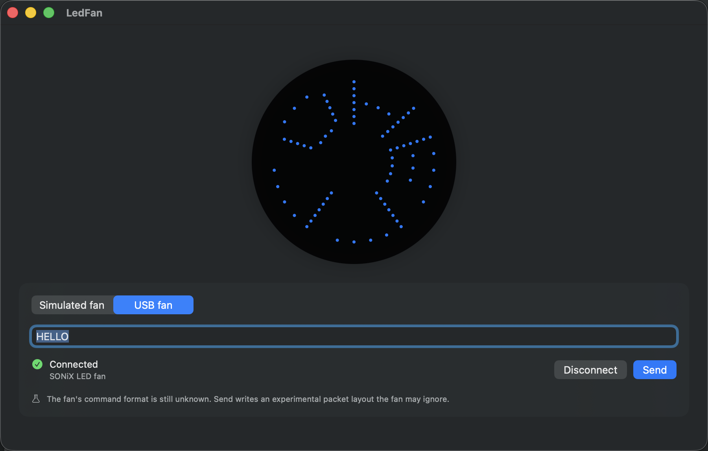

# Slice 2 — transport selection, first contact with the fan

**Date:** 2026-09-01
**Scope:** the "proposed next slice" from the slice 1 report: transport picker, first run
against the device, compile the HID probe, start `protocol-findings.md`.
**Status:** complete, awaiting architect approval. Slice 1 is committed as `079155f`;
slice 2 is uncommitted in the working tree.

## Summary

The app can now reach the fan from the UI, and it does: inside the App Sandbox with the
USB entitlement it connects, writes, and disconnects without error. The probe tool compiled
on the first try, and its first session produced three concrete facts about the device,
one of which changed the transport code. Nothing is yet known to change on the blades,
because no probing has happened with a person watching.

| Definition of done | Result |
|---|---|
| Builds with no warnings | Yes. |
| Tests pass | Yes. 40 unit tests, 2 UI tests, and the 2 hardware checklist tests pass with the flag and skip without it. Zero warnings. |
| Feature boxes ticked only where demonstrable | Yes. F4 matching and disconnect ticked; F5 "say so in the UI" ticked. Idempotent connect and the absent-device path remain open. |
| Hardware learnings in the docs | `protocol-findings.md` created; `hardware.md` corrected. |
| Acceptance report | This document. |

## What changed

### Transport selection (open question 2 from slice 1)
- `Domain/FanTransportProviding.swift`: `FanTransportKind` (simulated, hardware), the
  `FanTransportProviding` protocol, and `FixedTransportProvider` for tests and previews.
- `Transport/DefaultFanTransportProvider.swift`: production wiring.
- `FanMessageViewModel` depends on the provider, never on a concrete transport. Setting
  `transportKind` swaps the transport, resets status, error and arm length, and
  disconnects the previous transport in a detached task. `sendCaveat` carries the F5
  "protocol unknown" copy while the hardware kind is selected. The old
  `init(transport:)` survives as a convenience initializer, so existing tests were untouched.
- `ContentView` gained a segmented picker labelled "Fan transport" and the caveat label.
- Six new ViewModel tests cover the default kind, switching, connecting after a switch,
  re-selecting the same kind, the caveat, and the pinned-transport initializer.

### `HIDFanTransport` — one behavioural change
It no longer calls `IOHIDManagerOpen`. It sets matching, copies the devices, and opens the
`IOHIDDevice` directly. See finding 1 below for why. `disconnect()` still closes the device
and drops both handles.

### Hardware checklist as a gated UI test
`LedFanUITests/HardwareChecklistUITests.swift` drives `docs/testing.md`'s manual checklist
through the real UI. It skips unless `LEDFAN_HARDWARE` is `attached` or `absent`, so the
suite never depends on the fan. The `attached` run today:

- selected "USB fan" → status "SONiX LED fan: Not connected"
- Connect → "SONiX LED fan: Connected" (matching and open succeed under the sandbox)
- Send → no error banner (attachment "Send outcome": "Send completed without a reported error.")
- Disconnect → "Not connected", Send disabled

### Probe tool
`Tools/HIDFan/hidfan.swift` compiled first time with no changes. It was then rewritten to
decode `IOReturn` codes (it printed them as negative decimals, which hid finding 1), to
match without opening the manager, and to add `listen` and `feature` subcommands. The
binary is gitignored.

## Findings (all in `docs/protocol-findings.md`)

1. **Never call `IOHIDManagerOpen` on this device.** With the manager opened first,
   `IOHIDDeviceOpen` reports success but every `GET_REPORT` fails with `kIOReturnNotOpen`.
   Matching then opening the device directly works. Reproduced inside and outside the
   session's command sandbox. The draft transport, the draft probe and `hardware.md` all
   used the failing path; all three are corrected.
2. **The device never speaks first.** Two listening runs, 13 s total, zero input reports.
3. **The feature report is an endpoint-0 echo.** After enumeration it returns the last
   eight bytes of the report descriptor. After an output report it returns
   `21 09 00 02 00 00 08 00`, the SET_REPORT setup packet itself. It proves a write reached
   the firmware, which is one level deeper than `IOHIDDeviceSetReport` success, but it says
   nothing about the display. `protocol-discovery.md`'s hope that it would be a "Rosetta
   stone" does not hold for this device.
4. **Sweep and walking bit are silent.** All 256 first-byte values and all 64 single-bit
   frames were accepted, with no failures and no input reports. Whether any of them changed
   the blades is unknown: nobody was watching.

## Where the specification was wrong or silent

- `hardware.md` "Use `IOHIDManager`" needed the qualification in finding 1.
- `protocol-discovery.md` step 2 (feature report as state) does not apply here; the
  document is left as is because the method is still right for other devices, and the
  result is recorded in the findings log.
- `current-state.md` said `hidfan.swift` had never compiled; it compiled unchanged.
- `testing.md` called the hardware checklist "not automatable". Most of it is, when gated.

## Not done, and why

- **Absent-device path.** Needs the data cable unplugged. Run
  `TEST_RUNNER_LEDFAN_HARDWARE=absent … HardwareChecklistUITests` with the cable out.
- **Idempotent `connect()` on hardware.** The guard is in code; the UI offers no way to
  press Connect twice, and I did not want to add a hardware-only unit test.
- **Observed probing.** The sweep and bit walk need a person watching the fan. Both take
  under a minute; the tool and the log format are ready.
- **Open question 1 (angular resolution)** is still with the architect. The encoder was not
  touched, per the slice 1 report.

## Open questions for the architect

1. Angular resolution, carried over from slice 1.
2. Do you want a "what the fan is showing" indicator fed by the simulated transport's
   `frames` stream, or is the preview enough? (Carried over.)
3. Should the hardware checklist test live in the shipped UI test target, or under `Tools/`?
   It is gated and harmless in CI, so I left it in the target.

## Proposed next slice

1. **A probing session with Willie at the fan.** Run `hidfan sweep`, then `hidfan bits`,
   then framing candidates from `protocol-discovery.md` step 5, while they watch. Log every
   observation in `protocol-findings.md`.
2. **Route 1.** Ask whether the fan's Windows utility or its download link is still around;
   static analysis of it is worth more than any amount of blind probing.
3. If the sweep finds a command byte, build the real `FanPacketEncoding` behind it and
   replace `SequencedColumnEncoder`. Nothing else should need to change.
