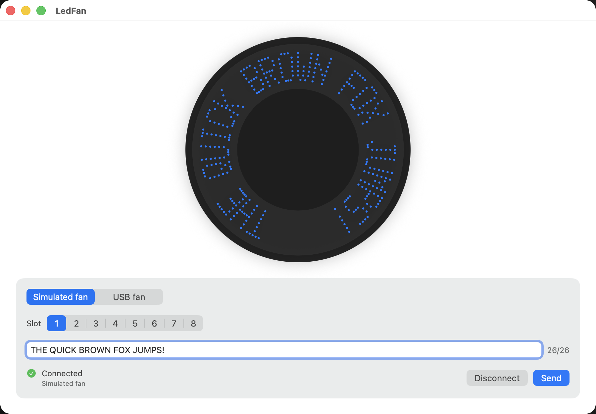

# Slice 4 — the preview becomes legible, the refusal becomes honest

**Date:** 2026-09-02
**Brief:** `docs/briefs/2026-09-02-slice-4-brief.md`, six tasks.
**Status:** complete. Software only; nothing was sent to the fan, and the device was not
opened by any code run in this slice (the hardware checklist tests were left skipped).
Committed at the end of the slice.

## Summary

The preview now shows text. A 26-character message renders as recognisable words around
the disc, upright across the top, with the unused arc dark; a short message occupies a
proportional arc centred on the top. Messages live in eight slots with a live 26-character
counter that refuses, and never cuts, over-length input. The encoder is split into the
known EEPROM framing, fully tested, and the one type that admits the table format is
unknown. The hardware transport connects and refuses to write, and there is no
report-writing call anywhere in the app target. Six docs were corrected at the source.

| Definition of done | Result |
|---|---|
| Builds with no warnings; all tests pass | Yes. 71 unit tests, 4 UI tests, 2 hardware checklist tests skipped without the flag. 0 warnings. |
| Boxes ticked only where demonstrable; `features.md` updated | Yes. One F5 box stays open: a message appearing on the blades. |
| Screenshots of the legible preview, both appearances | `images/2026-09-02-legible-preview-dark.png`, `-light.png`, captured by the UI test. |
| Acceptance report with "where the brief was wrong" | This document. |
| Everything committed | Yes, one commit for the slice. |

## Task by task

### Task 1 — commit first
Nothing to commit. The working tree was already clean when the slice started: a commit
titled "Slice 1, 2 and 3" (`7be831d`, authored by Willie on 2026-09-01) contains all 30
paths the brief lists, including every file in `Tools/probe-output/`. Slices 2 and 3 are
therefore *not* distinguishable in `git log`, and making them so would mean rewriting a
commit I did not make. I left history alone. See "Where the brief was wrong".

### Task 2 — D1, the legible preview
- `FanGeometry`, `ColumnStrip`, `POVFrame` (count always equals `columnsPerRevolution`;
  the initialiser pads or truncates), `MessageRasterizing.strip(for:ledsPerArm:)`,
  `FrameComposing.frame(from:geometry:columnOffset:)`, all as D1 specifies.
- `RevolutionComposer` lays the strip on a ring at least one revolution long, reads one
  revolution starting at `columnOffset`, wraps long strips, and mirrors each column so
  glyph tops sit at the rim. The ViewModel centres a short message on the top of the disc.
- `columnsPerRevolution` is 180 for the preview. A 26-character message is 156 columns,
  so it spans 312° and the words on the lower arc read rotated; that is what a disc does.
  A larger count would leave more dark and shrink the letters. 180 stays.
- The rasterizer is unchanged in character and knows nothing about geometry.
- `FrameComposerTests`: invariant, proportional arc, offset shift, negative wrap, identity
  at a full revolution, long-strip window and wrap, glyph tops on the outer LED, masking.

### Task 3 — D5, slots
- `FanMessage { slot, text }` with the limits as constants, a throwing initialiser, and
  `excessCharacters(in:)` for live feedback. Characters are counted as a person counts
  them (grapheme clusters).
- `FanDisplayTransport.store(_:)` replaces `display(_:)`; `geometry` replaces `ledsPerArm`.
- Slot picker 1–8, counter `n/26` that turns red, a caption naming the excess, Send
  disabled, draft never cut. Per-slot drafts survive slot changes. "Stored in slot N at
  HH:MM:SS" after a store (D3).
- D4 honoured: a caption names characters the preview draws blank.

### Task 4 — D8, the split encoder
- `EEPROMWriting` / `EEPROMWriter`: `A0`, address, up to six data bytes, zero padded,
  address advances by payload, wraps at 256 (8-bit model). Tested: packet size, header,
  address increment, padding, 26-byte and 156-byte payload counts, empty input, wrap, and
  the `0x18…0x23` stall-prone range, which is annotated in code in three lines.
- `MessageTableSerializing` / `UnknownMessageTableSerializer`: the one conformance, throws
  `.protocolNotYetKnown`, and is the only place in the app that says so.
- `FanPacketEncoding` and `SequencedColumnEncoder` are gone.

### Task 5 — D9, refuse honestly
- `HIDFanTransport` connects and reports a placeholder geometry. `store(_:)` runs the
  serializer (which throws today) and would frame packets, but the write step throws
  `.writingDisabled`: there is no `IOHIDDeviceSetReport` in the app target.
- The transport declares `storeAvailability = .unavailable(reason:)` with copy that says
  the fan's message format isn't known yet and that connecting still works. The ViewModel
  keeps Send disabled while that reason exists; a unit test checks the copy never mentions
  the cable. The hardware checklist test now asserts Send is disabled and the copy is shown.
- Not re-run against the device this slice, by choice: the owner was not at the fan and
  the brief said not to reach for it. The device-level part of this box rests on the
  unchanged connect path plus the gated test, not on a fresh run.

### Task 6 — the specification
- `protocol-discovery.md`: the return channels are stated as empty; live observation is
  stated as non-existent, with the cable-swap oracle; steps 1–3 of the method are marked
  done with their results; the guardrail is rewritten around the erased EEPROM and D7/D9.
- `hardware.md`: the two-phase section now records the erased demo and points at the
  corrected guardrail; `display(_:)` wording updated to `store(_:)`.
- `testing.md`: the rule that no automated test may write to the head, plus coverage lists
  for the composer, message, EEPROM writer and serializer, and the checklist updated.
- `architecture.md`, `design.md`, `features.md` (new F7, F2 and F5 rewritten),
  `current-state.md`: contracts, tokens, inventory and known problems brought in line.

## Where the brief was wrong

1. **Task 1's premise.** "30 uncommitted paths" were already committed, as one combined
   commit by the owner. The instruction to make two commits could only be met by
   rewriting history, so it was not met. The evidence the task protects is safe.
2. **"`hardware.md`'s bricking guardrail."** The bricking text lives in
   `protocol-discovery.md`, not `hardware.md`. Rewritten where it is, cross-referenced
   from `hardware.md`.
3. **D3 versus D5.** D3 says `SimulatedFanTransport.frames` stays. After D5 the transport
   never sees a frame, so the seam is `storedMessages: AsyncStream<FanMessage>`: same
   role, new currency, still tested.
4. **D5 versus D8.** D5 says `FanPacketEncoding` now takes a `FanMessage`; D8 replaces
   that seam with two protocols. D8 is newer and was followed; `FanPacketEncoding` no
   longer exists.
5. **D5's protocol shape has no way to say "cannot store".** Task 5 wants Send disabled
   rather than enabled-then-failing, and the ViewModel must not hard-code knowledge of a
   concrete transport. I added `nonisolated var storeAvailability: FanStoreAvailability`
   to `FanDisplayTransport`. One property, carries the user-facing reason. Needs a nod.
6. **D1 does not say which way up the glyphs go.** Strip bit 0 is the glyph top; frame
   bit 0 is the innermost LED; upright text on the upper arc needs glyph tops at the rim.
   I put the mirroring in the composer rather than changing the rasterizer's documented
   bit order. The alternative would have broken the F2 contract and its tests. Needs a nod.
7. **A new error case.** `.writingDisabled` is the D9 guard inside `HIDFanTransport`, so
   the transport does not become a second place that "admits the protocol is unknown".
   Unreachable today because the serializer throws first.

## Open questions for the architect

1. Accept `storeAvailability` on the transport contract (item 5)?
2. Accept mirroring in the composer as the orientation rule (item 6)?
3. Keep 180 columns, or trade letter size for a larger dark arc?

## Proposed next slice

Milestone 3 as the brief frames it: a timer driving `columnOffset` for scrolling, then
message persistence. Hardware stays paused until route 1b produces a table format; the
cheap first step there, a photograph of the head's PCB, still needs the owner's hands.
