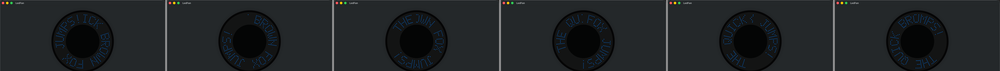
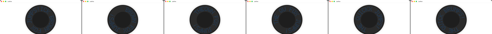

# Slice 7 — Milestone 3: scrolling, persistence, and finishing

**Date:** 2026-09-03
**Brief:** `docs/briefs/2026-09-03-slice-7-brief.md`, six tasks.
**Status:** complete. No hardware work; the fan, the protocol and `vendor/` were not touched.

## Summary

The app is finished as far as software can take it. Long messages scroll as a marquee
driven by a `TimelineView` that pauses for Reduce Motion, an inactive scene, or a message
with nothing to scroll; the eight slots and the selected slot persist through a protocol
with a file store in the container and a transient store for tests; D4 is closed with the
hint shipping and the unused property deleted; and the docs now describe a project that
chose to stop. One arithmetic fact shaped the slice and is the heart of the Task 3
recommendation: at 180 columns per revolution, the longest allowed message, 26 characters,
is 156 columns and fits, so nothing scrolls in the shipped configuration.

| Definition of done | Result |
|---|---|
| Builds with no warnings; all tests pass | Yes. 88 unit tests, 8 UI tests, 2 hardware checklist tests skipped without the flag. 0 warnings. |
| Boxes ticked only where demonstrable; `features.md` updated | Yes. The F5 blades box stays open and says why. |
| Recording or frame strip of scrolling, both appearances | `images/2026-09-03-scroll-strip-dark.png`, `-light.png`: six frames half a second apart. |
| Acceptance report with "where the brief was wrong" | This document. |
| Everything committed | Yes. |

## Task by task

### Task 1 — clean tree
`git status --porcelain` was empty. Nothing to do, as the brief anticipated.

### Task 2 — scrolling
- The ViewModel exposes `scrollingIsPossible` (strip longer than a revolution) and a pure
  `previewFrame(at:)`: the composer's frame at `columnOffset = -round(elapsed × speed)`,
  over the strip with `Motion.scrollGapColumns` of dark appended so the wrap is a gap, not
  a seam. A nil date returns the static frame. The epoch resets on every edit.
- `ScrollingPreview` in `ContentView` is a `TimelineView(.animation(paused:))`. It is paused
  unless there is something to scroll, `accessibilityReduceMotion` is off, and
  `scenePhase == .active`. No `Timer`, no queue, nothing mutated on a tick.
- Direction: towards the left of the top arc, so new characters enter on the right.
- **A short message stands still**, centred on the top of the disc. Decided and documented
  in `design.md` and `features.md`: there is nothing to scroll, and a still frame is easier
  to judge than a moving one.
- Speed, gap and cadence are `Motion` tokens in `DesignSystem/Theme.swift`.
- Tests: fits-one-revolution never scrolls; empty never scrolls; advance equals the token
  speed; one full period returns to the start; the wrap gap is dark; nil date is static.
- Evidence at `-columnsPerRevolution 120`, because at the shipped 180 no message qualifies
  (see Task 3). The accessibility label gains ", scrolling" while moving, which the UI test
  asserts in both directions.

### Task 3 — `columnsPerRevolution`, a recommendation, not a change

Three captures of the 26-character message, unchanged code, the value overridden by the
launch flag:

| Columns | What happens to the longest allowed message | Image |
|---|---|---|
| 120 | scrolls; letters about 50 % wider than at 180 | `images/2026-09-03-candidate-120-columns.png` |
| 150 | scrolls; letters about 20 % wider | `images/2026-09-03-candidate-150-columns.png` |
| 180 | fits, stands still; the shipped value | `images/2026-09-03-candidate-180-columns.png` |

Two facts the screenshots make plain. First, the revolution width changes only the width of
the letters: their height is fixed by the LED band, so no value buys taller text. Second,
the lower-arc rotation that D12 accepted is not fixed by any value either, because a
message that scrolls still occupies the whole disc while it passes.

**Recommendation: keep 180.** The longest message the fan allows fits one revolution and
holds still, which is the better state for judging what you typed; a narrower value would
turn every 25- or 26-character message into a marquee for a modest gain in letter width.
The consequence should be stated rather than hidden: in the shipped app scrolling is a
tested, working capability that no allowed message reaches. It stays because the real
head's column count is unknown (D1) and may turn out smaller, and because it costs nothing
when idle. If the architect would rather have it visible, 150 is the value that makes the
longest messages scroll while keeping shorter ones still.

### Task 4 — persistence
- `MessageStoring` in Domain: `load() async -> SavedDrafts?`, `save(_:) async throws`.
  `SavedDrafts` normalises in its initialiser and its decoder: eight slots always, selected
  slot clamped.
- `FileMessageStore`, an actor, writes JSON atomically to
  `Application Support/LedFan/drafts.json` inside the container. Absent, unreadable or
  corrupt data loads as nil, and the ViewModel treats nil as empty slots.
- `TransientMessageStore` for previews and UI tests; the app picks it on
  `-transientStore YES`, so the UI tests never touch the real container.
- The ViewModel restores in `.task`, saves on every edit and slot change, and reports a
  failed save through `lastError`. A recording double proves all of it off the disk.
- First launch now shows empty slots, per the brief, where it used to show "HELLO".

### Task 5 — D4 closed
The blank-glyph hint exists and works: `blankGlyphHint` names each character with no glyph,
once, and the caption shows it; unit tested and visible in the UI. It never used
`GlyphFont.supportedCharacters`, which had no other caller, so the property is deleted.
**D4 closes with the hint shipping and the property gone.**

### Task 6 — finished docs
`README.md` opens with where the project stands and a reading order that starts at
`current-state.md`; `current-state.md` describes the finished app, what is blocked and why,
and where the hardware investigation stands; `brief.md`'s milestones carry their outcomes
and the D5 wording; `features.md` gains the scrolling boxes and F8 (drafts survive
relaunch); `design.md`, `architecture.md`, `testing.md` and `onboarding.md` carry the new
contracts, tokens and coverage.

## Where the brief was wrong

1. **"A message longer than one revolution scrolls."** True of the code, but no allowed
   message is longer than the shipped revolution. The brief did not notice that the
   26-character limit and D12's 180 columns leave scrolling unreachable; Task 3's
   recommendation exists to put that in front of the architect.
2. **"Evidence for scrolling is a recording or a strip of frames."** XCTest attaches its own
   screen recordings, but only for failing tests, so the strips were composited from six
   timed window captures instead. A recording of a passing run needs a test plan setting the
   project does not have.
3. **"Corrupt or absent stored data yields empty slots."** Followed, with a visible side
   effect the brief did not mention: the first-run "HELLO" is gone. The transient store
   used by tests and previews keeps it.
4. **"Reduce Motion must stop the animation."** Done, and also `scenePhase`, which the brief
   framed as "when the window is not visible". On macOS `scenePhase` tracks the app's
   scenes, not one window's occlusion; a window hidden behind another keeps animating. A
   per-window occlusion check would need AppKit, which the standards discourage. Stated as a
   limit rather than worked around.
5. **Task 1's phrasing** was right and needed no action; noted because the brief itself made
   a point of it.

## Open items for the architect

1. Task 3: keep 180 (recommended) or adopt 150 to make scrolling visible.
2. Whether the `-columnsPerRevolution` and `-transientStore` launch flags, which exist for
   evidence and tests, should stay in the shipping binary. They are harmless and read only
   from user defaults; they could equally be `#if DEBUG`.

## What is left

Nothing scheduled. The app is finished; the hardware chapter waits on evidence from outside
the repository, and the docs say so.
