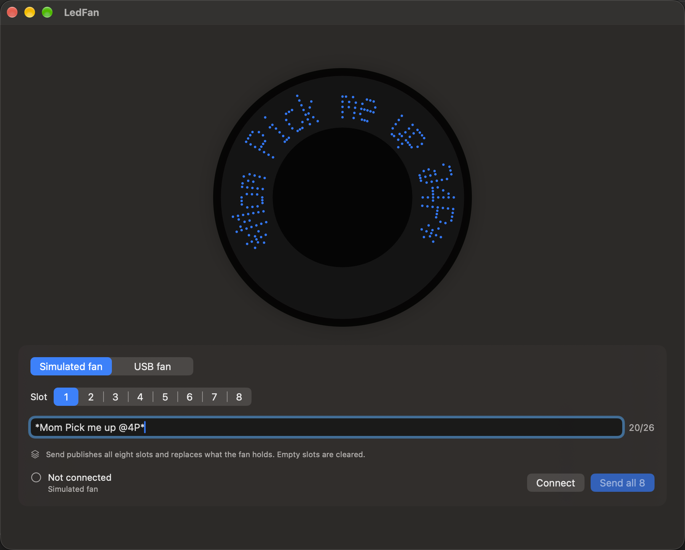
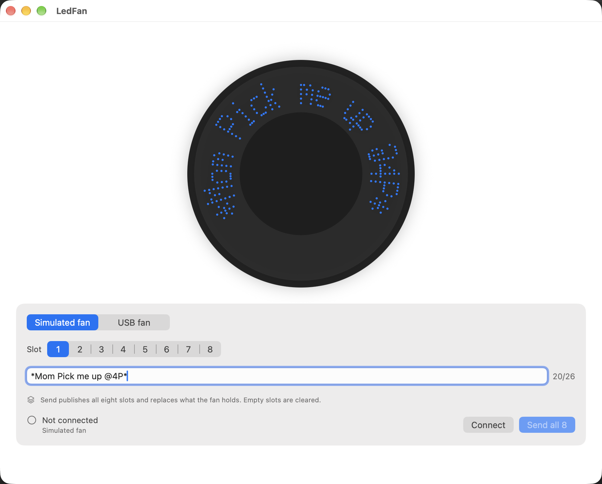

# Slice 10 — make it behave like a product

**Date:** 2026-09-25
**Brief:** `docs/briefs/2026-09-25-slice-10-brief.md`. D21, D19, D20, D18.
**Status:** software complete and committed; the one hardware check follows the owner's
checklist below and its result is appended when made.

## Summary

Four behaviours, in the brief's order. The app now notices the fan being unplugged and drops
to Disconnected on its own, with copy that says so; a `SetReport` on a dead handle is read
the same way. Send publishes all eight slots, empty ones as blank images, and the button and
a caption say so. Every report's echo is compared to what was sent and the receipt states the
confirmed, differing and missing counts, saying "every report was confirmed" only when true.
The font has lowercase, with descenders one row below the baseline, and the factory demo's
own line renders in mixed case. The effect codes are transcribed in the findings.

| Definition of done | Result |
|---|---|
| Builds with no warnings; all tests pass, golden tests included | Yes. 150 unit tests (an eight-slot golden among them), 10 UI tests, 2 hardware tests skipped without the flag. 0 compiler warnings. |
| One send, one swap, observation verbatim | Pending, below. |
| Report with "where the brief was wrong" | This document. |
| Everything committed | Yes. |

## Task by task

### Task 1 — D21, device removal
- `FanDisplayTransport` gains `connectionEvents: AsyncStream<FanConnectionEvent>`; the
  hardware transport yields `.lost(reason:)` from IOKit's removal callback, through a
  `RemovalFlag` actor and the Sendable bridge the callbacks already used. The ViewModel
  watches the stream after Connect and stops watching on Disconnect or a transport switch.
- `SetReport` answering `kIOReturnBadArgument`, `kIOReturnNotOpen`, `kIOReturnNoDevice`,
  `kIOReturnNotAttached` or `kIOReturnOffline` releases the handle and throws
  `.deviceRemoved`; Connect after a removal reopens cleanly.
- Copy: "The fan was unplugged. Plug the data cable back in and press Connect again."
- Tests: a transport throwing `.deviceRemoved` on Send lands the ViewModel in Disconnected
  with that copy; an unplug event does the same without a Send; an unplug after an orderly
  Disconnect is ignored.

### Task 2 — D19, Send writes all eight slots
- `store(_:)` takes `[FanMessage]`; the ViewModel sends the eight persisted drafts in slot
  order, ids 0–7; the encoder already renders an empty text as a blank image.
- The button reads "Send all 8" and a caption says it replaces what the fan holds and clears
  empty slots. An over-length draft in any slot blocks Send and is named by slot number.
- Tests: all eight sent with empties blank; blank images not omitted; the golden test
  extended to an eight-slot send, 320 reports, generated from the reference library with the
  factory demo's first four lines and four of ours.

### Task 3 — D20, echo verification
- `EchoVerification`: an echo confirms its report when identical, or identical but for bit 0
  of the first byte (the header's `A0` returned as `A1`). Mismatches and missing echoes are
  counted, never fatal.
- `FanStoreReceipt` carries `confirmedCount`, `mismatchedCount`, `missingCount` and
  `everyReportConfirmed`; the summary says "Every report was confirmed by the fan's echo"
  only when all were, otherwise the counts.
- Tests: all confirmed, some mismatched, short echo lists; the receipt copy in both shapes;
  a stub transport's receipt shown verbatim by the ViewModel.

### Task 4 — D18, lowercase
- 26 lowercase glyphs on the 5x7 grid: x-height letters on rows 2–6, ascenders from row 0
  or 1, descenders (g j p q y) reaching row 7. Lookup is exact first, then uppercase, then
  blank, so anything without a glyph still falls back.
- The rasterizer's centring leaves the descender at arm row 9 of 11; a test shows "ag"
  renders the g one row below the a's baseline without clipping or shifting.
- Screenshots of `*Mom Pick me up @4P*` in both appearances, above.

### Also
- Effect codes transcribed in `protocol-findings.md`, Slice 10.
- `features.md` F5 closed with Milestone 2 noted; `current-state.md`, `brief.md`,
  `docs/README.md` and `onboarding.md` describe an app that publishes to its fan.

## The owner's checklist for the hardware check

Fan A only; Fan B stays sealed.

1. Fan A **switched off**, **data cable** into the head, power cable out. Say "data cable in".
2. I run the hardware test, which types all eight slots into the app for you — the factory
   demo's first four lines, lowercase included, then `HELLO WILLIE`, `Slot six`, `Slot
   seven`, `Slot eight` — connects, and sends. 320 reports; with echoes it takes a few
   seconds. I'll say "swap now" and tell you what the receipt said.
3. Data cable out, power cable in, switch on.
4. Watch a couple of full cycles and tell me: how many different messages cycle; whether
   `Mom Pick me up` reads in mixed case with a real lowercase p and y; and anything odd.

## Results

*(appended after the check)*

## Where the brief was wrong

*(completed with the results)*
