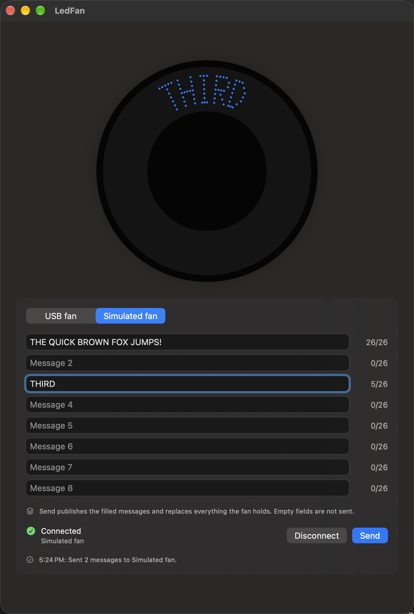
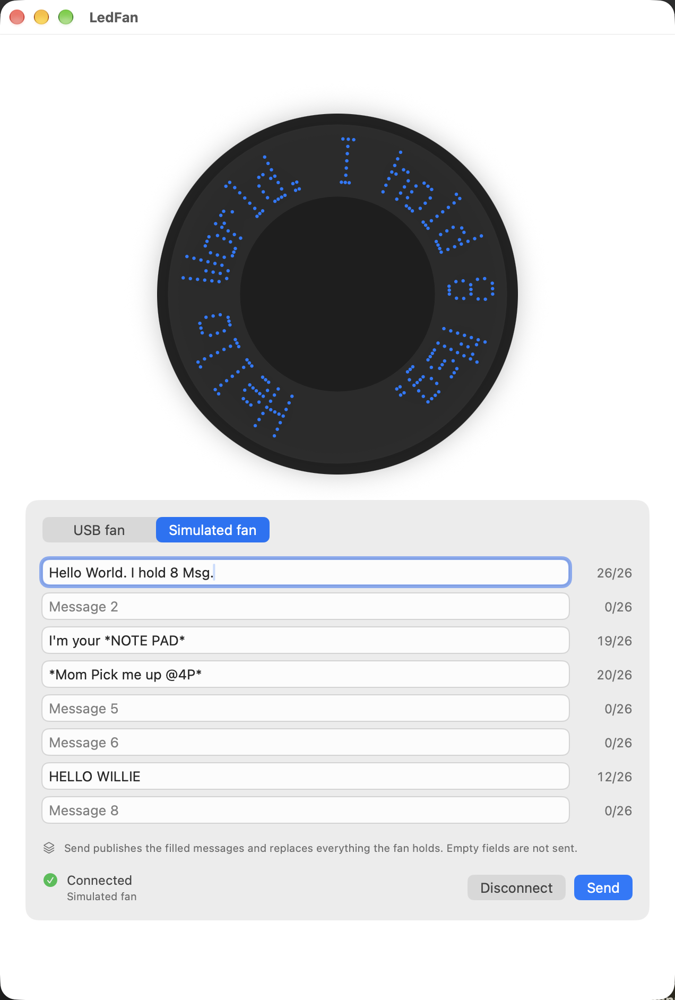

# Slice 11 — the interface, rearranged

**Date:** 2026-09-26
**Brief:** `docs/briefs/2026-09-26-slice-11-brief.md`. D22, D23, D24, with D3 and `design.md`.
**Status:** complete. One send, one swap: four filled fields, four messages on the fan, no dark gaps.
UI only: nothing below the ViewModel changed. The protocol, the encoder, the transport, the
inbox and the echo verification are byte-for-byte as slice 10 left them.

## Summary

The preview on top and eight fields below it (two columns were built, then reverted at the
owner's request after he saw them). Eight fields visible at once, each with its own counter and
accessibility label, Tab moving through them, the preview following keyboard focus. Send
publishes only the filled fields, compacted and numbered from 0, so three filled fields
mean three messages on the fan and no dark gaps; all empty disables it. The USB fan is the
first segment and the launch default, and launching with no fan attached is a quiet "Not
connected". The interface shows no report counts, bytes, timings or echo statistics; it
says "Sent 3 messages to SONiX LED fan." and, when the fan fails to confirm, an error.
Echo verification still runs in the transport and lands in the send log.

| Definition of done | Result |
|---|---|
| Builds with no warnings; all tests pass, golden tests included | Yes. 144 unit tests (a compacted three-message golden among them), 9 UI tests, 2 hardware tests skipped without the flag. 0 compiler warnings. |
| Screenshots in both appearances | `images/2026-09-26-layout-dark.png`, `-light.png`, several fields filled. |
| One send, one swap, observation verbatim | Done: "The fan cycles 4 messages, no dark gaps". |
| Report with "where the brief was wrong" | This document. |
| Everything committed | Yes. |

## Task by task

### Task 1 — horizontal layout, then reverted at the owner's request
Built as the brief asked, checked on the fan, and then reverted the same day: after seeing
the two columns, the owner preferred the preview on top. The app now stacks the preview
above the eight fields and controls, minimum width 600pt, opening at 640pt (the first
stacked build opened at 900pt, which looked needlessly wide; narrowed on request). The screenshots
below are the stacked layout that shipped; the two-column build is in the history
(commits `a4e65ff` and `1c7b776`). The paragraphs that follow describe that build.
`ViewThatFits(in: .horizontal)` with the controls column and the preview side by side, the
preview square and centred in its column, and the stacked arrangement (preview above) as
the fallback. Minimum window width 760pt, ideal 1040pt, controls column at least 340pt, all tokens in
`Layout`. The preview is a fixed 340pt square, so resizing never distorts it.

One subtlety worth recording: `ViewThatFits` compares each arrangement's *ideal* size to
the space, and a column of text fields and captions has a large ideal width, so the first
screenshot came out stacked in a 900pt window. Giving the controls column an ideal width
equal to its minimum, and letting captions wrap, makes the two-column arrangement fit at
every width above the minimum and grow into whatever space there is.

### Task 2 — eight fields
`FanMessageViewModel` holds `fieldTexts` and exposes `text(forField:)`,
`setText(_:forField:)`, per-field counters and `overLengthFields`. The view builds a
`Binding` per field, focuses each with `@FocusState<Int?>`, and forwards focus changes to
the ViewModel. Labels are "Message 1" … "Message 8"; counters are labelled "Message n: k
of 26 characters". Persistence is unchanged: the eight texts save on every edit.

**The preview follows focus.** With no focus it shows the first filled field; with nothing
filled and no focus it is blank and labelled "Fan preview, nothing to show". In practice
macOS gives Message 1 keyboard focus at launch, so the launch preview is Message 1, empty
or not; the "first filled" rule applies whenever focus is not in a field.

### Task 3 — D22, compacted send
`filledMessages` takes the non-empty fields in order and numbers them from 0. `canSend`
needs at least one. The button reads "Send" (accessibility: "Send the filled messages to
the fan") and the caption says it publishes the filled messages and replaces everything
the fan holds. Tests: three of eight become ids 0–2; a gap compacts; all empty disables;
the golden test covers a compacted three-message send generated from the reference.

### Task 4 — D23, USB fan first and default
`FanTransportKind` orders `hardware` first; the ViewModel's default kind is `.hardware`.
Not connected is the resting state in secondary colour; the error styling appears only for
`.failed`, after Connect. The removal watch is stopped on a transport switch and started
by the next Connect, with a test that an old transport's unplug is ignored after a switch
and the new one's is honoured.

### Task 5 — D24, diagnostics out, errors in
The ViewModel no longer shows the transport's receipt text. Success is
"HH:MM: Sent N messages to <fan>." When the receipt says not every report was confirmed,
the interface shows an error, "The fan did not confirm everything it was sent…", with no
counts. Every `FanTransportError` message reaches the interface unchanged. The transport's
receipt summary, with its counts, still exists and the per-report echoes are in the send
log; nothing below the ViewModel was touched to achieve this.

### Evidence plumbing, flagged
- **One AppKit call.** XCUITest can only capture windows on the primary display, and a
  fresh SwiftUI window opens on whichever display is active, which follows the pointer.
  A test-only launch option, `-pinWindowToPrimaryDisplay`, moves the window there with
  `NSWindow.setFrameOrigin`. It is the only AppKit use in the app and does nothing in
  normal use.
- **Seeds are percent-encoded.** `-seedDrafts` values pass through UserDefaults' old-style
  plist parsing, which turned `*Mom Pick me up @4P*` into `*Mom\ Pick\ me\ up\ @4P*`.
  Found by the UI test, before it could corrupt the hardware check.

## The owner's checklist for the hardware check

Fan A only; Fan B stays sealed.

1. Fan A switched off, data cable into the head, power cable out. Say "data cable in".
2. I run the hardware test. It seeds four fields with gaps between them — Message 1 "Hello
   World. I hold 8 Msg.", Message 3 "*Mom Pick me up @4P*", Message 5 "HELLO WILLIE",
   Message 8 "Message eight" — connects, and sends. I'll say "swap now".
3. Data cable out, power cable in, switch on.
4. Watch two full cycles and tell me exactly how many different messages cycle, in what
   order, and whether there is any dark pause between them.

## Results

- **Send.** Fan A, switched off, data cable in. The hardware UI test seeded fields 1, 3, 5
  and 8, connected, and sent; the app published the four filled fields as images 0–3.
  Success line, verbatim: "5:10 PM: Sent 4 messages to SONiX LED fan." No error, so every
  echo matched; the counts are in the send log, not on screen (D24).
- **Swap.** Owner's observation, verbatim: **"The fan cycles 4 messages, no dark gaps."**
- **What it settles.** Compaction is right: the fan cycles exactly what was filled, in field
  order, and a gap in the fields is not a gap on the fan. The defect D22 exists to fix is
  gone, and the plain success copy carried everything the owner needed to know.

## Where the brief was wrong

1. **"Controls on the left, the fan on the right"** read correctly on screen and was
   built, and the owner, seeing it, preferred the preview on top. Reverted the same day;
   the brief's layout was the one thing in it that did not survive contact with its author.
2. **"With no focus, the first non-empty field."** Implemented, but on macOS the first
   field takes keyboard focus at launch, so "no focus" is rarely the state the user sees.
   The UI test asserts the launch state, "message 1, empty"; the unit tests cover the
   no-focus rule. Documented in `design.md`.
3. **"Anything below the ViewModel is out of scope."** Held for the protocol, encoder and
   transport. Two things below the view did change and are stated here: `FanTransportKind`
   reordered so the USB fan is first (a Domain enum, D23 demands it), and one AppKit call
   in the App struct behind a test-only launch option, because SwiftUI cannot place a
   window on a given display and XCUITest can only capture the primary one.
4. **"Every `FanTransportError` message survives verbatim."** They do, and one more piece
   of transport copy survives that the brief did not list: the hardware caveat explaining
   the cable-and-switch procedure. It is instruction, not diagnostics, so it stayed.
5. **The golden test "updated to a compacted send."** Added rather than replaced: the
   eight-slot golden from slice 10 still stands as a framing check, and a three-message
   compacted golden sits beside it.
6. **UserDefaults and asterisks.** Nothing in the brief could have known that seeding a
   field through a launch argument mangles `*`; the UI test caught it before the fan did.

## Open items for the architect

1. The findings note from 2026-09-25 that the fan displays **red** and the column format
   carries a colour bit. Out of scope here (no encoder changes); a one-send experiment
   whenever colour matters.
2. The 5x7 lowercase m/n and u/U legibility from slice 10 still stands.
